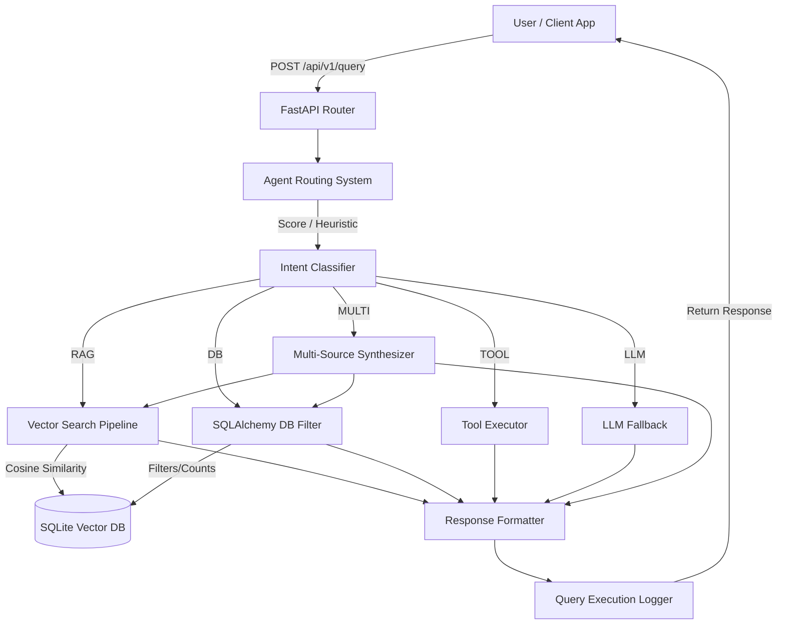

# IT Helpdesk & Knowledge Assistant

A production-ready AI system combining **Retrieval-Augmented Generation (RAG)** with **Intelligent Agent Routing** to handle multiple types of queries: document retrieval, database queries, tool execution, and general knowledge questions.

## Overview

This system demonstrates a sophisticated approach to building enterprise AI assistants by:

1. **Intelligent Query Routing** - Classifies queries into types (RAG, DB, TOOL, LLM, MULTI) using an LLM
2. **RAG Pipeline** - Retrieves relevant documents from a vector database (ChromaDB)
3. **Tool Integration** - Safely executes calculations and other operations
4. **Multi-Source Queries** - Combines information from multiple sources
5. **Complete Logging** - Tracks all requests, routing decisions, and performance metrics

## Architecture

```
Query Input
    ↓
Agent Router (LLM-based classification)
    ↓
┌─────────────────────────────────────────────────┐
│ RAG          │ DB      │ TOOL        │ LLM       │
├─────────────────────────────────────────────────┤
│ Retrieve &   │ Query   │ Calculator  │ General   │
│ Generate     │ Database│ & Tools     │ Knowledge │
└─────────────────────────────────────────────────┘
    ↓
LLM-based Response Generation
    ↓
Database Logging
    ↓
Response Output
```

## Tech Stack

- **Framework**: FastAPI
- **LLM**: Groq (llama-3.3-70b-versatile)
- **Embeddings**: Sentence Transformers (all-MiniLM-L6-v2)
- **Vector Store**: ChromaDB (persistent)
- **Database**: SQLite + SQLAlchemy
- **No LangChain/LlamaIndex** - Pure implementation

## Project Structure

```
internal-helpdesk-ai/
├── main.py                          # FastAPI application & routes
├── requirements.txt                 # Project dependencies
├── .env.example                     # Environment variables template
├── README.md                        # This file
├── chroma_data/                     # ChromaDB persistent storage
├── helpdesk.db                      # SQLite database
└── app/
    ├── __init__.py
    ├── core/
    │   └── config.py               # Configuration & logging
    ├── db/
    │   └── database.py             # SQLAlchemy models & session
    ├── llm/
    │   └── groq_client.py          # Groq API wrapper
    ├── rag/
    │   ├── chunker.py              # Document chunking (600 tokens + overlap)
    │   ├── embeddings.py           # Embedding generation & retrieval
    │   └── retriever.py            # ChromaDB vector retrieval
    ├── tools/
    │   └── calculator.py           # Safe calculator tool (using ast)
    ├── agent/
    │   └── router.py               # Smart query router & classifier
    ├── schemas/
    │   └── request.py              # Pydantic request/response models
    └── services/
        └── query_service.py        # Main orchestration logic
```

## Installation

### 1. Clone/Setup Project
```bash
cd "c:\Users\Ankit\Downloads\New folder (3)"
```

### 2. Create Virtual Environment (Optional)
```bash
python -m venv .venv
.venv\Scripts\activate
```

### 3. Install Dependencies
```bash
pip install -r requirements.txt
```

### 4. Configure Environment
Create a `.env` file from the template:
```bash
cp .env.example .env
```

Edit `.env` and set your Groq API key:
```
GROQ_API_KEY=your_groq_api_key_here
```

Get your API key from: https://console.groq.com/

### 5. Run Application
```bash
python main.py
```

Server starts at: `http://localhost:8000`

## API Endpoints

### 1. Health Check
```bash
GET /health
```
Check system status.

**Response**:
```json
{
  "status": "healthy",
  "message": "System is operational",
  "database_connected": true,
  "chroma_initialized": true
}
```

### 2. Ingest Document
```bash
POST /ingest
```
Add documents to the knowledge base.

**Request**:
```json
{
  "content": "Document content here...",
  "source": "policy_handbook.pdf",
  "metadata": {"category": "policies"}
}
```

**Response**:
```json
{
  "success": true,
  "chunks_created": 5,
  "message": "Document ingested successfully with 5 chunks"
}
```

### 3. Query (Main Endpoint)
```bash
POST /query
```
Process an intelligent query using RAG + Agent system.

**Request**:
```json
{
  "query": "What is the VPN setup procedure?",
  "include_reasoning": false
}
```

**Response**:
```json
{
  "query": "What is the VPN setup procedure?",
  "answer": "The VPN setup involves...",
  "query_type": "RAG",
  "routing_reason": "Query requires document retrieval",
  "retrieved_documents": [
    {
      "text": "VPN Setup Guide...",
      "metadata": {"source": "vpn_guide.pdf"},
      "distance": 0.15
    }
  ],
  "tool_used": null,
  "latency_ms": 1234.5,
  "tokens_used": 512
}
```

### 4. Batch Evaluation
```bash
POST /eval
```
Evaluate multiple queries at once.

**Request**:
```json
{
  "queries": [
    "How do I reset my password?",
    "What is 2 + 2?",
    "Tell me about company benefits"
  ]
}
```

**Response**:
```json
{
  "total_queries": 3,
  "results": [
    {
      "query": "How do I reset my password?",
      "answer": "...",
      "query_type": "RAG",
      ...
    },
    ...
  ]
}
```

### 5. Query Logs (Debug)
```bash
GET /logs?limit=20
```
View recent query logs for debugging and monitoring.

## Query Types

### RAG (Retrieval-Augmented Generation)
Document/knowledge base queries.
- Example: "What is the password reset procedure?"
- Action: Retrieve from ChromaDB + Generate grounded response

### DB (Structured Data)
Company database queries.
- Example: "List all employees in the IT department"
- Action: Query structured data + Generate response

### TOOL (Computation)
Mathematical calculations and tool use.
- Example: "What is 156 * 23 + 45?"
- Action: Safe calculator evaluation

### LLM (General Knowledge)
General knowledge and chitchat.
- Example: "What are the benefits of AI?"
- Action: Pure LLM generation

### MULTI (Multi-Source)
Queries requiring multiple sources.
- Example: "Compare employee salary with industry average"
- Action: Combine RAG + DB + LLM

## Key Features

### 1. Smart Agent Router (25% weight)
- Uses Groq LLM to classify query type
- Returns JSON with `type` and `reason`
- Supports multi-source queries
- Automatic detection of calculations

```python
router.route("What is 2 + 2?")
# Returns: {"type": "TOOL", "reason": "Mathematical calculation detected", "expression": "2 + 2"}
```

### 2. RAG Pipeline (25% weight)
- **Chunking**: Documents split into 600-token chunks with 100-token overlap
- **Embeddings**: Using sentence-transformers (all-MiniLM-L6-v2)
- **Storage**: Persistent ChromaDB vector store
- **Retrieval**: Top-k semantic search with cosine similarity

```python
# Ingest
POST /ingest with document

# Query uses top-5 relevant chunks for grounding
```

### 3. Tool System (10% weight)
- Safe calculator using Python's `ast` module
- No eval() - completely safe
- Supports: +, -, *, /, %, ** operators
- Extensible for additional tools

```python
calculate("2 + 2 * 3")  # Returns: 8.0
```

### 4. Database Logging
- `documents` table: Stored documents and metadata
- `query_logs` table: Every request logged with:
  - Query text and type
  - Routing reason
  - Retrieved documents
  - Tool execution details
  - Latency and token usage
  - Error tracking

### 5. Production Features
- Full structured logging
- Error handling and recovery
- Request/response validation (Pydantic)
- CORS support
- Health checks
- Async-ready architecture
- Comprehensive documentation

## Configuration

All settings in `app/core/config.py`:

```python
# RAG
CHUNK_SIZE=600              # Tokens per chunk
CHUNK_OVERLAP=100           # Overlap between chunks
TOP_K_RETRIEVAL=5           # Documents to retrieve

# LLM
LLM_MODEL=llama-3.3-70b-versatile
LLM_TEMPERATURE=0.2         # Low for factual questions
LLM_MAX_TOKENS=1024

# Embedding
EMBEDDING_MODEL=all-MiniLM-L6-v2
```

## Example Usage

### Using Python Requests
```python
import requests

BASE_URL = "http://localhost:8000"

# Ingest a document
ingest_response = requests.post(
    f"{BASE_URL}/ingest",
    json={
        "content": "VPN Setup: 1. Download client 2. Enter credentials...",
        "source": "vpn_guide.pdf"
    }
)
print(ingest_response.json())

# Query
query_response = requests.post(
    f"{BASE_URL}/query",
    json={"query": "How do I set up VPN?"}
)
print(query_response.json())

# Batch eval
eval_response = requests.post(
    f"{BASE_URL}/eval",
    json={"queries": ["What is 2+2?", "VPN setup?"]}
)
print(eval_response.json())
```

### Using cURL
```bash
# Ingest
curl -X POST "http://localhost:8000/ingest" \
  -H "Content-Type: application/json" \
  -d '{
    "content": "VPN Setup Guide...",
    "source": "vpn_guide.pdf"
  }'

# Query
curl -X POST "http://localhost:8000/query" \
  -H "Content-Type: application/json" \
  -d '{"query": "How do I set up VPN?"}'

# Health
curl http://localhost:8000/health
```

## Performance Metrics

The system logs:
- **Latency**: Time to process query (in milliseconds)
- **Tokens Used**: LLM token consumption
- **Retrieved Documents**: Number and relevance of RAG results
- **Tool Execution Time**: Calculator and tool timing

Monitor in `GET /logs`:
```json
{
  "logs": [
    {
      "query": "What is 2+2?",
      "type": "TOOL",
      "latency_ms": 145.3,
      "tokens_used": 128
    }
  ]
}
```

## Troubleshooting

### Issue: GROQ_API_KEY not set
**Solution**: Set environment variable in `.env` file
```
GROQ_API_KEY=your_key_here
```

### Issue: ChromaDB connection error
**Solution**: Clear `chroma_data/` directory and restart
```bash
rm -rf chroma_data/
python main.py
```

### Issue: Database locked
**Solution**: Delete `helpdesk.db` and restart
```bash
rm helpdesk.db
python main.py
```

## Testing

Test the system with sample queries:

```bash
# Test RAG
POST /query: "What is the onboarding process?"

# Test TOOL
POST /query: "Calculate 25 * 4 + 10"

# Test LLM
POST /query: "What is machine learning?"

# Test MULTI
POST /query: "Which department has the highest salary and how do they benefit from remote work policy?"
```

## Next Steps (Production Enhancements)

- Add PostgreSQL support (replace SQLite)
- Implement authentication & API keys
- Add query caching layer
- Deploy with Docker
- Setup monitoring & alerting
- Add WebSocket support for real-time streaming
- Implement prompt caching
- Add semantic web search integration
- Multi-language support

## Notes

- This implementation uses **no LangChain or LlamaIndex** - all agent logic is manual
- Documents are **persistent** in ChromaDB - survives restarts
- All queries are **logged** for audit and improvement
- The system is **extensible** - easy to add new tools and sources

## License

MIT

---

**Built with ❤️ for enterprise AI systems**



## Routing Workflow Explanation

The routing intelligence evaluates each incoming query by assigning scores across four main categories:
1. **TOOL**: Detects math operations and conversions.
2. **DB**: Detects exact organizational keywords (employee, hr, active, expires).
3. **RAG**: Detects process and document-heavy keywords (policy, deploy, vpn).
4. **MULTI**: If a query has strong signals for *both* DB and RAG, it triggers a multi-source pipeline.

The routing engine dynamically parses the query, executes the necessary operations, logs latency, tools used, and retrieved documents, and returns the unified answer.

## Setup Instructions

### Requirements
- Python 3.9+
- SQLite (included)

### Installation

1. **Clone the repository:**
   ```bash
   git clone <repo-url>
   cd <project-folder>
   ```

2. **Create a virtual environment & install dependencies:**
   ```bash
   python -m venv .venv
   # Windows
   .venv\Scripts\activate
   # macOS/Linux
   source .venv/bin/activate
   pip install -r requirements.txt
   ```

3. **Configure Environment:**
   Create a `.env` file in the root directory (optional) or set the Groq API Key:
   ```env
   GROQ_API_KEY=your-api-key-here
   ```

4. **Run the Application:**
   ```bash
   python main.py
   ```
   The application will run on `http://localhost:8000`. Test data and DB tables are seeded automatically upon the first run.

## API Examples

### 1. Querying the Helpdesk

**Endpoint:** `POST /api/v1/query`

**Payload:**
```json
{
  "query": "How many active users and what is the onboarding process?"
}
```

**Response:**
```json
{
  "query": "How many active users and what is the onboarding process?",
  "routing_decision": "MULTI",
  "tools_used": ["DB_Query", "Vector_Search"],
  "retrieved_docs": ["Employee Onboarding Process: New hires must complete the IT security training..."],
  "db_result": {"type": "count", "result": 4, "message": "Found 4 matching records."},
  "answer": "**Database Result:**\n4\n\n**Documentation Answer:**\nThere are 4 active users...",
  "latency_ms": 1245.33,
  "success": true
}
```

### 2. Ingesting Documents

**Endpoint:** `POST /api/v1/ingest`

**Payload:**
```json
{
  "text": "New refund policy for 2026...",
  "metadata": {"source": "Finance_Wiki"}
}
```

## Evaluation Endpoint

Run a full evaluation on the agent router using the pre-configured edge cases and metrics generation.

**Endpoint:** `POST /api/v1/eval`

**Response Example:**
```json
{
  "results": [
    {
       "query": "VPN reset process",
       "routing_decision": "RAG",
       ...
    }
  ],
  "summary": {
    "total_queries": 15,
    "successful_queries": 15,
    "success_rate_percentage": 100.0,
    "average_latency_ms": 845.12,
    "route_distribution": {
      "RAG": 4,
      "DB": 6,
      "TOOL": 3,
      "MULTI": 2,
      "LLM": 0
    }
  }
}
```

## Screenshots and Demo

### Screenshots
*Placeholders for actual project screenshots:*


### Demo Video
*Placeholder for project demo video:*
[](#)

## Code Quality Standards

This project enforces strict modularity:
- `api/`: API Routes and Schemas
- `agent/`: Manual agent routing layer
- `core/`: LLM integration, Logging, Configs
- `db/`: SQLAlchemy Models and Session config
- `rag/`: Vector DB retrieval logic and ingestion
- `tools/`: Independent tools (Calculator, Search)
